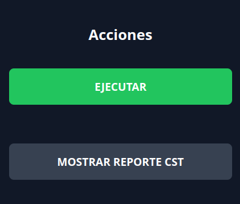
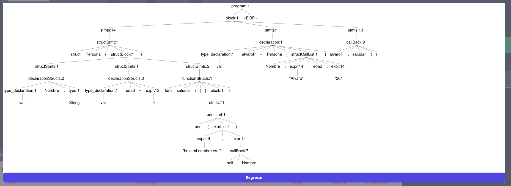
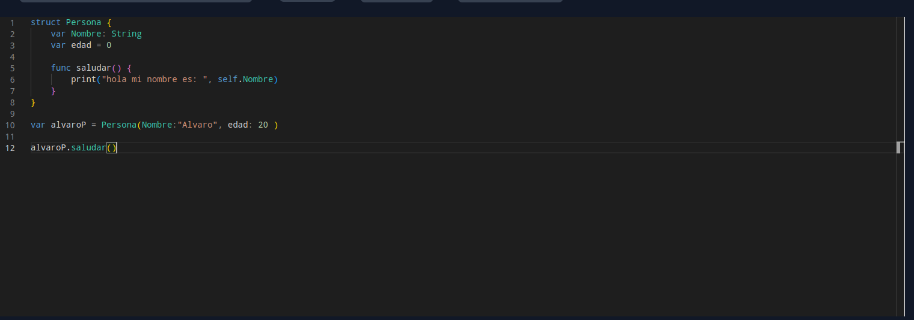
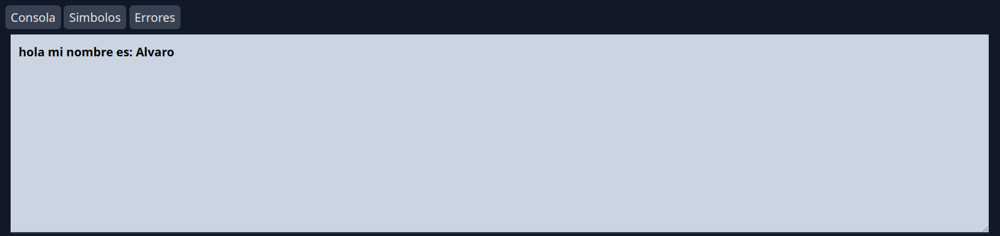
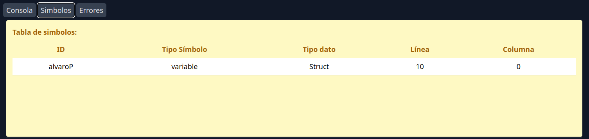
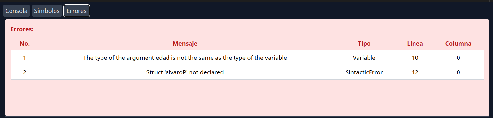
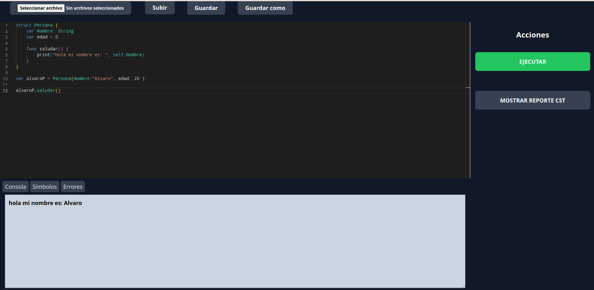

# Manual de Usuario
## Introducción
El lenguaje de programación **T-Swift** es un lenguaje de programación basado en el lenguaje de programación **Swift**. El lenguaje de programación **T-Swift** es un lenguaje de programación orientado a estructuras, el cual cuenta con las siguientes características:

- **Variables**: Las variables pueden ser de tipo `var` o `let`. Las variables de tipo `var` pueden ser mutables, mientras que las variables de tipo `let` son inmutables. Las variables pueden ser de tipo `Int`, `Float`, `String`, `Bool` o `Struct`. Las variables de tipo `Struct` son estructuras definidas por el usuario.
```swift
var x: Int = 10
let y: Int = 20
var z = "Hola"
var w: String?
```

- **Funciones**: Las funciones pueden ser de tipo `func`. Las funciones de tipo `func` puede retornar un valor o no retornar un valor. Las funciones pueden recibir parámetros de tres forma diferentes `externos e internos`, `externos _ internos` o `ambas`.

```swift
// parametros externos e internos
func suma(x: Int, y: Int) -> Int {
  return x + y
}
// parametros externos _ e internos
func suma(_ x: Int, _ y: Int) -> Int {
  return x + y
}
// parametros externos e internos = ambas
func suma(x: Int, y: Int) -> Int {
  return x + y
}
// funcion vacia
func vacia() {
  print("Hola")
}
```
- **Vectores**: Los vectores pueden ser de tipo `var` o `let`. Los vectores de tipo `var` pueden ser mutables, mientras que los vectores de tipo `let` son inmutables. Los vectores pueden ser de tipo `Int`, `Float`, `String`, `Bool` o `Struct`. Los vectores de tipo `Struct` son estructuras definidas por el usuario.
```swift
var x: [Int] = [1, 2, 3]
let y: [Int] = [1, 2, 3]
var z = ["Hola", "Mundo"]
var w: [Int] = []
```

- **Matrices**: Las matrices pueden ser de tipo `var` o `let`. Las matrices de tipo `var` pueden ser mutables, mientras que las matrices de tipo `let` son inmutables. Las matrices pueden ser de tipo `Int`, `Float`, `String`, `Bool` o `Struct`. Las matrices de tipo `Struct` son estructuras definidas por el usuario.
```swift
var x: [[Int]] = [[1, 2, 3], [4, 5, 6]]
let y: [[Int]] = [[1, 2, 3], [4, 5, 6]]
var z = [["Hola", "Mundo"], ["Hola", "Mundo"]]
var w: [[Int]] = []
```

- **Structs**: Los structs son estructuras definidas por el usuario. Los structs pueden contener variables, vectores, matrices y funciones. Los structs pueden ser de tipo `var` o `let`. Los structs de tipo `var` pueden ser mutables, mientras que los structs de tipo `let` son inmutables. La funcione pueden ser mutables o inmutables, lo que significa que la propiedad self se comporta acorde a la mutabilidad de la funcioń.
```swift
// Structs con funciones
struct Avion {
    var pasajeros = 0 
    var velocidad = 1200
    var nombre: String
    var piloto: String

    // metodo dentro de struct 

    mutating func frenar(){
        //al ser mutable sí afecta al struct 
        self.velocidad = 100
    }
        
    // funcion inmutable 
    func mostrarVelocidad(){
        print("Velocidad -> ",self.velocidad) 
    }
}

var avioneta = Avion( nombre: "78496", piloto: "Joel") 
var avionet2 = Avion( nombre: "78296", piloto: "Alvaro") 

avionet2.frenar()
avioneta.mostrarVelocidad()
avionet2.mostrarVelocidad()
```

## Funcionamiento de la aplicación web 
La aplicación web se encuentra en el siguiente enlace: [T-Swift]( http://localhost:5173/). La aplicación web cuenta con 4 secciones importantes: 

- **Navbar**: La navbar cuenta con 3 botones: `Subir Archivo`, `Guardar` y `Guardar como`. El botón `Subir Archivo` permite subir un archivo con extensión `.tswift` para ser analizado. El botón `Guardar` permite guardar el archivo actual. El botón `Guardar como` permite guardar el archivo actual con un nombre diferente. 
  

- **SideBar**: La sidebar cuenta con 2 botones: `Ejecutar` y `Mostrar reporte CT` . El botón `Ejecutar` permite ejecutar el archivo actual. El botón `Mostrar reporte CT` permite mostrar el reporte de errores de la última ejecución.
  
  
  
- **Editor**: El editor permite escribir código en el lenguaje de programación **T-Swift**. El editor cuenta con las siguientes características:
  - **Autocompletado**: El editor cuenta con autocompletado de código. El autocompletado de código se activa con la tecla `Ctrl + Espacio`.
  - **Resaltado de sintaxis**: El editor cuenta con resaltado de sintaxis. El resaltado de sintaxis se activa con la tecla `Ctrl + Shift + P`.
  
  
- **Consola**: La consola cuenta con tres botone `Consola`, `Símbolos` y `Errores`. El botón `Consola` permite mostrar la consola de la última ejecución. El botón `Símbolos` permite mostrar los símbolos de la última ejecución. El botón `Errores` permite mostrar los errores de la última ejecución.

  
  
  

## Vista general
